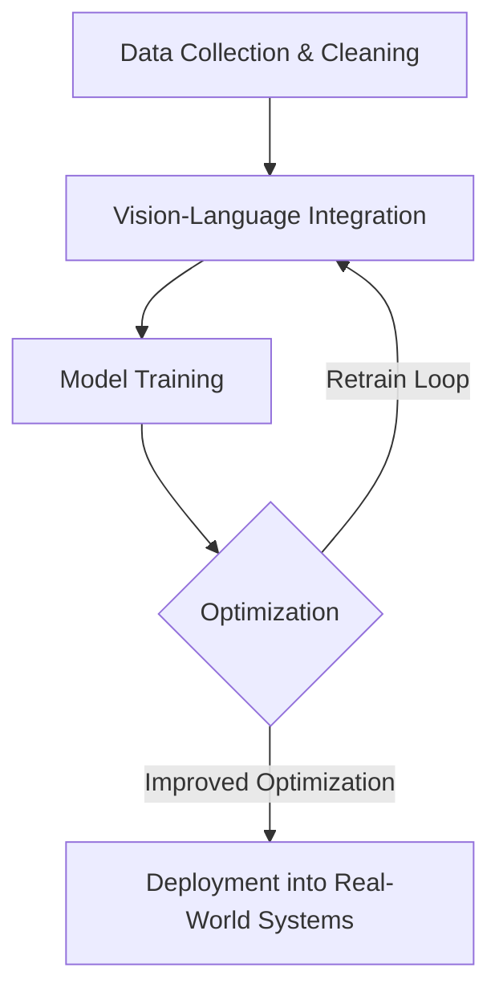

# 🔥 Yashvardhan Gupta | AI Enthusiast

Hello, world! 👋  
I'm **Yashvardhan Gupta**, a **dedicated AI enthusiast** with a strong foundation in **mathematics and innovation**. My passion lies in transforming complex, abstract challenges into **elegant, automated solutions** that bridge the gap between technology and the physical world.

✨ _Inspired by Jensen Huang's vision, "everything that moves will be automated,"_ I strive to develop **intelligent systems** that interact seamlessly with dynamic, real-world environments.

---

## 🚀 Current Focus
### 🔧 Projects
- **Vision-Language-Action (VLA) Models**: Researching **generalist robot policies** to perform unseen dexterous tasks.
- **Generative Diffusion Models**: Exploring concepts inspired by **Google DeepMind** to redefine creativity and automation.

### 🧐 Expertise
I specialize in end-to-end model development:
1. **Model Research**: Innovating cutting-edge algorithms.
2. **Algorithm Design**: Optimizing models for efficiency and scalability.
3. **Deployment & Testing**: Deploying systems in **dynamic real-world environments**.

---

## 📊 Quick Stats

### 🧠 **Technical Skills**
| **Category**          | **Skills & Tools**                                                                 |
|------------------------|-----------------------------------------------------------------------------------|
| **Programming**        | Python (NumPy, PyTorch, TensorFlow, JAX/Flax), C++, MATLAB                       |
| **AI/ML**             | Neural Networks, Vision Systems, Reinforcement Learning, Generative Models        |
| **Software Tools**     | Docker, Kubernetes, GCP, Edge AI Frameworks                                      |

---

## 🌟 Featured Projects
1. [**AI-Powered Adaptive LED Matrix**](https://github.com/BrutalCaeser/AI-powered-adaptive-LED-matrix):  
   Adaptive intelligence for creative **light displays** using real-time edge computing.
2. [**Read My Lips**](https://github.com/BrutalCaeser/read_my_lips):  
   Highlights **speech recognition** advancements via **lip-reading AI.**
3. [**Studio**](https://github.com/BrutalCaeser/studio):  
   Tool for **camera management, APIs,** and automation.

---

## 📚 Life Beyond AI
- **♟ Chess**: Refining **strategic thinking** for decision-making.  
- **📖 Reading**: Exploring a wide range of topics including **philosophy, technology, and storytelling.**  
- **🎾 Tennis**: Staying energized and competitive both on and off the court.

---

## 📈 AI Workflow Infographic

With an **underlying process pipeline**, this graphic emphasizes continual system improvement and efficiency.