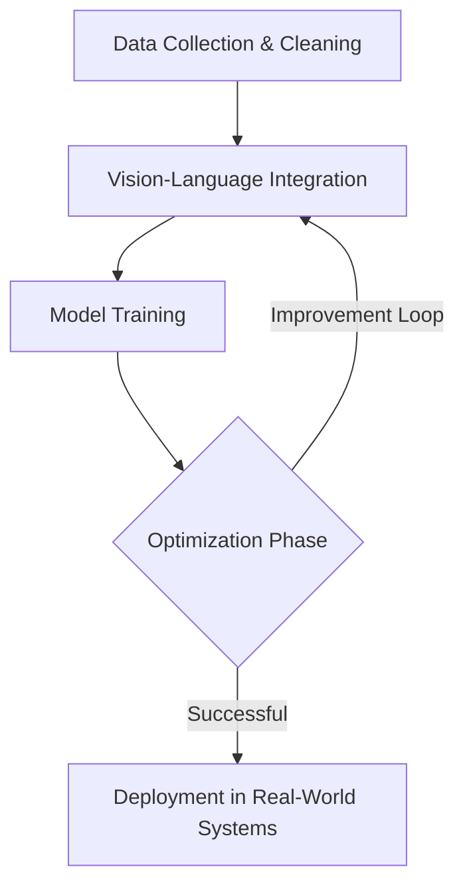

# \\ud83d\\udd0b Yashvardhan Gupta | AI Enthusiast

Hello, world! \\ud83d\\udc4b  
I'm **Yashvardhan Gupta**, a dedicated **AI enthusiast** with a strong foundation in **mathematics and innovation**. My passion lies in transforming complex, abstract challenges into **elegant, automated solutions** that bridge the gap between **technology and the physical world**.

\\ud83c\\udf1f Inspired by the words of Jensen Huang—_“everything that moves will be automated”_—I strive to design intelligent systems that work seamlessly in dynamic, real-world environments.

---

## \\ud83d\\ude80 Current Focus
### \\ud83d\\udee0 Projects
- **Vision-Language-Action (VLA) Models**: Researching generalist robot policies to perform **unseen dexterous tasks** in real-world environments.
- **Generative Diffusion Models**: Working with concepts inspired by **Google DeepMind**, pushing the boundaries of generative models for creativity and automation.

### \\ud83d\\udd0d Expertise
My skill set includes end-to-end model development:
1. **Model Research**: Ideation and innovation of state-of-the-art algorithms.
2. **Algorithm Design**: Engineering models for efficiency and scalability.
3. **Deployment & Testing**: Deployment in **dynamic (real-world)** environments.

---

## \\ud83d\\udcca Quick Stats

### \\ud83e\\uddd0 **Technical Skills**  
| **Category**          | **Skills & Tools**                                                                 |
|------------------------|-----------------------------------------------------------------------------------|
| **Programming**        | Python (NumPy, PyTorch, TensorFlow, JAX/Flax), C++, MATLAB                       |
| **AI/ML**             | Neural Networks, Vision Systems, Reinforcement Learning, Generative Models        |
| **Software Tools**     | Docker, Kubernetes, GCP (Tensor Processing Units), Edge AI Frameworks            |

---

## \\ud83d\\udcda Beyond AI
Outside the lab, I take inspiration and energy from:
- **\\ud83d\\udc51 Chess**: Sharpening **strategic thinking** for optimized decision-making.
- **\\ud83d\\udcda Reading**: A diverse love for **topics ranging across philosophy, technology, and storytelling**.
- **\\ud83c\\udfbe Tennis**: Staying competitive and energized off-screen.

---

## \\ud835\\udd80\\ud835\\uddff\\ud835\\uddf5 Featured Projects
\\ud83c\\udf1f Check out some of my highlighted work:
1. [AI-Powered Adaptive LED Matrix](https://github.com/BrutalCaeser/AI-powered-adaptive-LED-matrix):
   - Adaptive intelligence for creative **light displays**.
   - Uses **real-time edge computing** for environments.
2. [Read My Lips](https://github.com/BrutalCaeser/read_my_lips):
   - Advances in **speech recognition** via lip-reading technologies.
   - Employs deep learning frameworks to create **accessibility-focused solutions**.
3. [Studio](https://github.com/BrutalCaeser/studio):
   - Integrates **camera controls, APIs**, and closed AI packages for smart automation.

---

## \\ud83c\\udf1f Infographic Highlights

### **AI Workflow Overview**
