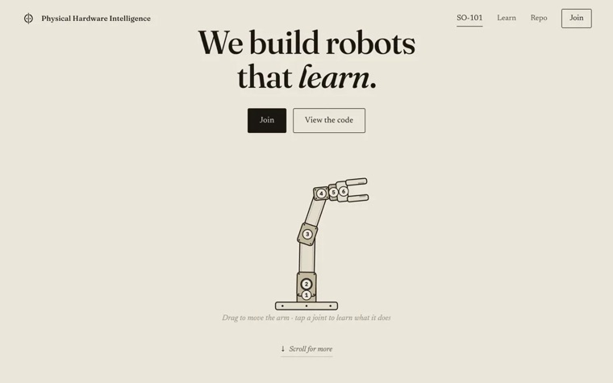
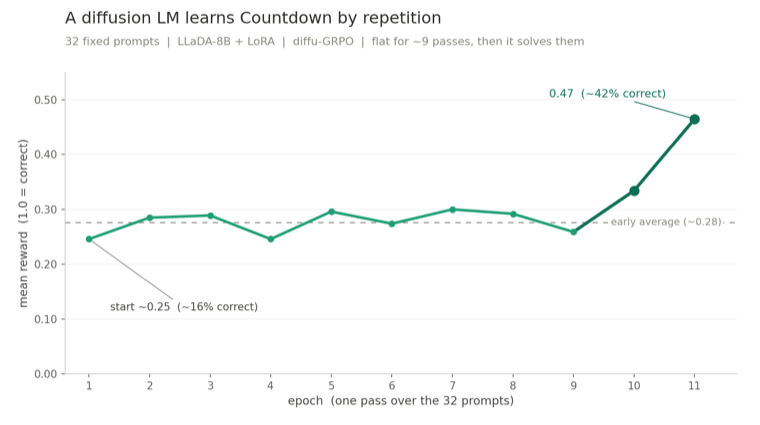
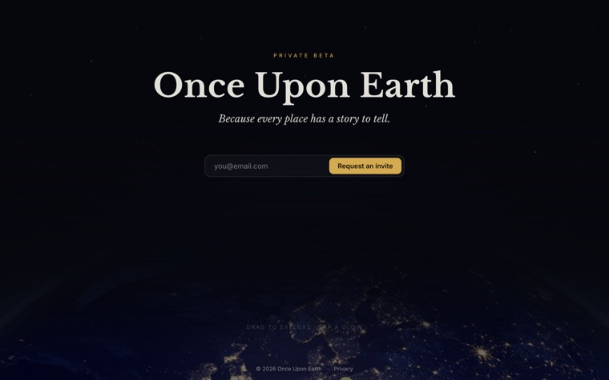

---

### 👋 Hey, I'm Yash

I'm an MS AI student at **Northeastern University** (Silicon Valley), trying to understand how generative models learn the structure of language, video, and the physical world. I started out in mechanical engineering, so I care less about chasing leaderboards than about the math underneath. Calculus and Bayesian probability are the parts that feel right to me, and they happen to be the spine of diffusion and flow-based modeling.

Most of what I build doesn't work the first time. I've had research bets collapse (entropy-weighted masking, SIGReg representation lines), and the rigor of chasing them down is the real asset. So I write up the negative results too, and I'm still hunting for the problem that feels *inevitable* and *mine*.

- 🔬 Working on **diffusion / flow-matching language models**, **video world models**, and **representation collapse** in self-supervised learning.
- 🦾 Co-founded **[Φ (Physical Hardware Intelligence)](https://physical-hardware-intelligence.github.io/)**, Northeastern Silicon Valley's first student robotics club. We build robots that learn on the open SO-ARM101 arm, and I designed and built the club's site.
- 🛠️ **AI/GenAI Engineering Co-op at NovasIQ**, building deterministic agentic systems on Claude + MCP.
- 🎓 Reinforcement Learning **teaching assistant** at Khoury College (DQN, PPO, policy gradients).
- 🔗 **Full portfolio, projects & writing → [brutalcaeser.github.io](https://brutalcaeser.github.io/)**

---

### 🧭 What I'm working on now

| | |
|---|---|
| 🦾 **[Φ (Physical Hardware Intelligence)](https://github.com/physical-hardware-intelligence/phi)** | The robotics club I co-founded at Northeastern SV: an open robot-learning pipeline on the SO-ARM101 arm (teleoperate, record, train, deploy). I also designed and built the [club site](https://physical-hardware-intelligence.github.io/). |
| 🎯 **[reinforcing_dLLMs](https://github.com/BrutalCaeser/reinforcing_dLLMs)** | Reinforcement learning (diffu-GRPO) for reasoning in diffusion LLMs. I validated the one-step log-prob estimator the method hinges on, then showed RL lifts held-out Countdown ~4 pp on a single GPU (a faithful run is ~24 GPU-days). |
| 🧩 **[block-diffusion-pareto](https://github.com/BrutalCaeser/block-diffusion-pareto)** | Mapped the full quality↔throughput frontier for block-diffusion LMs and found generation throughput peaks at **block size 32**, the unpublished value a leading commercial model reportedly runs. |
| 🌀 **[phantom-gradients](https://github.com/BrutalCaeser/phantom-gradients)** | When a model's useful features live in far fewer dimensions than its embedding, training fights noise in the empty ones. A coherence-guided sampler recovers the structure without knowing the true dimension, beating even an oracle that does. |
| 🌊 **[Flow-Language-Model](https://github.com/BrutalCaeser/Flow-Language-Model)** | Reproducing and extending Flow-Map language models (one-step text generation), where I found a quality curve the original paper missed. |

---

### 🎬 A few, in pictures

<table>
  <tr>
    <td width="33.33%" align="center" valign="top">
      
       <b>Φ · robots that learn</b>
       The robotics club I co-founded, and its site
    </td>
    <td width="33.33%" align="center" valign="top">
      
       <b>RL on diffusion LLMs</b>
       Reward climbs as it learns to reason
    </td>
    <td width="33.33%" align="center" valign="top">
      
       <b>Once Upon Earth</b>
       A 3D globe of history, grounded AI stories
    </td>
  </tr>
</table>

---

### ✍️ Recent writing

- [**From Noise to Shakespeare**](https://brutalcaeser.github.io/writing/from-noise-to-shakespeare/) — building a diffusion language model from scratch
- [**From K-Means to Gaussian Mixtures**](https://brutalcaeser.github.io/writing/gmm-mle-em/) — the math, the intuition, and the EM algorithm
- [**Lagrangians, KKT & SVMs**](https://brutalcaeser.github.io/writing/lagrangian-kkt-svm/) — a mathematical journey to the margin

---

### 🧰 Tools I reach for

+ JAX/Flax · CUDA · Hugging Face · Claude + MCP · ONNX

---

**Most-used languages**

<!--LANGS:START-->

  
  
  
  
  

<!--LANGS:END-->

<!-- Contribution snake — regenerated daily by .github/workflows/snake.yml -->
<picture>
  <source media="(prefers-color-scheme: dark)" srcset="https://raw.githubusercontent.com/BrutalCaeser/BrutalCaeser/output/github-snake-dark.svg"/>
  <source media="(prefers-color-scheme: light)" srcset="https://raw.githubusercontent.com/BrutalCaeser/BrutalCaeser/output/github-snake.svg"/>
  
</picture>

---

*Away from the screen: chess, tennis, and slowly working through a philosophy reading list. Borrowed beliefs bore me.*

📊 Stats, languages, and the snake refresh themselves on a schedule, so this page is never quite stale.

